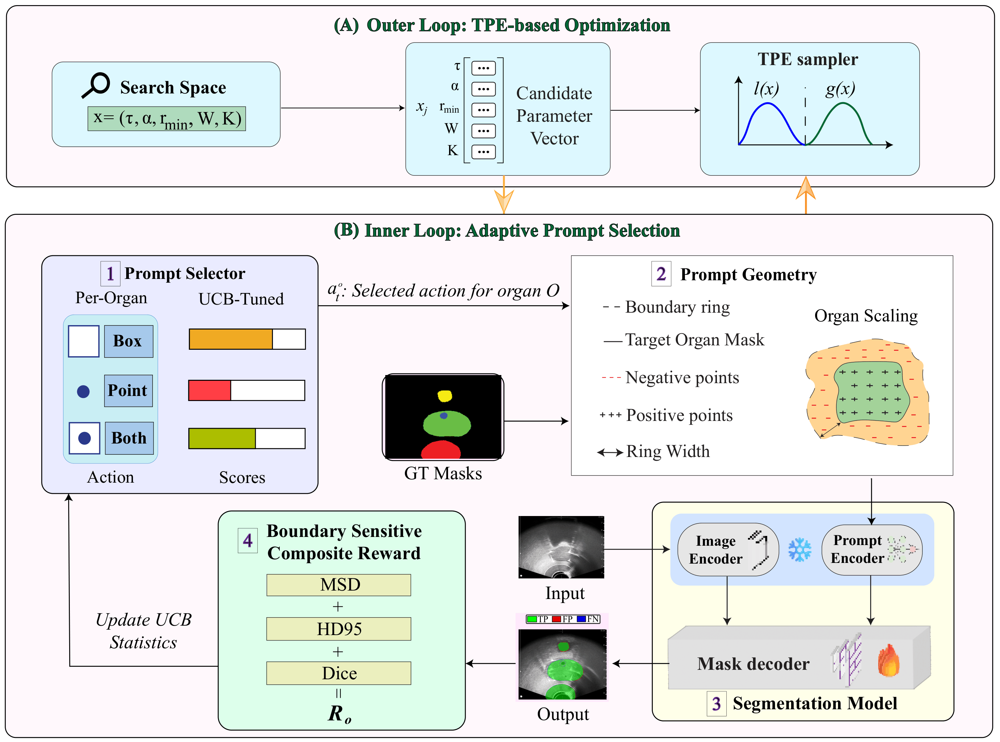

# BAP-MOS

**BAP-MOS: Bandit-Based Adaptive Prompting for Boundary-Sensitive Multi-Organ Segmentation**

**Authors:** Satvik Praveen, Shengji Jin, Ahmed Lamidi, Yi Sheng, Xin Qian

## Overview

BAP-MOS is a bandit-based adaptive prompting framework for boundary-sensitive multi-organ ultrasound segmentation. It dynamically selects prompting strategies based on organ-specific segmentation performance, enabling adaptive prompt allocation without modifying the foundation-model backbone.

The framework is evaluated on prostate TRUS and bladder PFUS ultrasound datasets using SAM/MedSAM-based segmentation backbones.

## Framework



*Overview of the BAP-MOS framework.*

## Main results

Mean ± std over three training seeds (42, 43, 44).
Prostate distance metrics (MSD and HD95) are in millimeters; PFUS1 distances use pixel-equivalent units (see [`docs/RESULTS.md`](docs/RESULTS.md)).

See [`docs/RESULTS.md`](docs/RESULTS.md) for detailed results and per-seed outputs.

### Prostate TRUS (pooled test)

| Method               | Dice ↑            | HD95 (mm) ↓       | MSD (mm) ↓        |
| -------------------- | ----------------- | ----------------- | ----------------- |
| nnU-Net              | 0.962 ± 0.002     | 1.113 ± 0.131     | 0.432 ± 0.035     |
| U-Net                | 0.965 ± 0.004     | 0.932 ± 0.158     | 0.369 ± 0.045     |
| SAM                  | 0.981 ± 0.002     | 0.527 ± 0.062     | 0.221 ± 0.001     |
| MedSAM               | 0.941 ± 0.002     | 2.736 ± 0.725     | 0.868 ± 0.100     |
| **BAP-MOS (SAM)**    | **0.982 ± 0.001** | **0.482 ± 0.016** | **0.204 ± 0.023** |
| **BAP-MOS (MedSAM)** | **0.979 ± 0.006** | **0.577 ± 0.032** | **0.229 ± 0.013** |

### Bladder PFUS1

### External PFUS1 generalization

| Method | Dice ↑ | HD95 (px) ↓ | MSD (px) ↓ |
|---|---:|---:|---:|
| FPN | 0.710 | — | — |
| **BAP-MOS (MedSAM)** | **0.849 ± 0.007** | **10.062 ± 0.55** | **5.034 ± 0.015** |

Distance metrics for the external PFUS1 pelvic-floor dataset are reported
in pixel-equivalent units.

## Repository structure

```text
BAPMOS/
├── configs/              # Shared protocol and dataset configurations
├── experiments/          # Paper experiment definitions and ablations
├── src/
│   └── bapmos/
│       ├── method/       # Main BAP-MOS training
│       ├── hpo/          # TPE / search procedures
│       ├── losses/       # Training objectives
│       ├── preprocess/   # Prostate, bladder, delineation preprocessing
│       ├── inference_output/
│       ├── results/      # Result collation
│       ├── external_baselines/
│       └── legacy/       # Historical experiments
├── scripts/              # Execution helpers
├── docs/                 # Reproduction and experiment documentation
├── tests/                # Smoke / unit tests
├── data/                 # Dataset placeholders; data not distributed
├── models/               # SAM / MedSAM checkpoint locations
├── results/              # Collated experimental results
├── requirements.txt
├── requirements-hpo.txt
├── requirements_cpu.txt
├── requirements_dev.txt
└── requirements_nnunet.txt
```


## Reproduce main results

From the `BAPMOS/` directory:

```bash
# Install deps (pinned stacks — see requirements*.txt). No pyproject / editable install.
pip install -r requirements.txt
pip install -r requirements-hpo.txt    # Optuna outer-loop
pip install -r requirements_dev.txt    # pytest (+ optional notebook extras)
# CPU-only workstation: pip install -r requirements_cpu.txt
# nnU-Net baseline (separate env): see requirements_nnunet.txt

# Always run modules from BAPMOS/ with src on PYTHONPATH (scripts/bapmos.sh does this):
export PYTHONPATH="$(pwd)/src${PYTHONPATH:+:$PYTHONPATH}"

# Pretrained weights (see docs/WEIGHTS.md) — must live under BAPMOS/models/
mkdir -p models/sam_base models/medsam
curl -L -o models/sam_base/sam_vit_b_01ec64.pth \
  https://dl.fbaipublicfiles.com/segment_anything/sam_vit_b_01ec64.pth
curl -L -o models/medsam/medsam_vit_b.pth \
  https://zenodo.org/records/10689643/files/medsam_vit_b.pth

# Data (see docs/PREPROCESS.md / data/*/README.md)
# Real data are not shipped. Build or symlink into:
#   data/prostate/pooled/  ← pooled prostate
#   data/bladder/pfus1/    ← PFUS1 bladder

# Preprocess
./scripts/bapmos.sh preprocess-prostate --dry-run
./scripts/bapmos.sh preprocess-bladder --dry-run
./scripts/bapmos.sh preprocess-delineation --help

# BAP-MOS outer loop (TPE on validation MSD) — prostate
# Smoke: one trial. Full budget: see experiments/prostate/bapmos/outer_loop/tpe/
python -m bapmos.hpo.study_runner run \
  --hpo-suite bapmos_bo \
  --dataset pooled \
  --n-trials 1
# python -m bapmos.hpo.study_runner --help

# BAP-MOS inner loop (production) — prostate
# ALWAYS use --version + --dataset so selected/ merges (docs/INNER_OUTER_LOOP.md).
# Run AFTER outer-loop export. ALL THREE seeds — see docs/SEEDS.md.
python -m bapmos.method.bap_mos_trainer \
  --version bapmos --dataset pooled \
  --experiment pooled_seed42
# python -m bapmos.method.bap_mos_trainer --help

# One baseline (example: UNet) — also three seeds
python -m bapmos.external_baselines.unet.train_multiclass \
  --data_root data/prostate/pooled \
  --seed 42 \
  --run_name pooled_seed42
# Notes: experiments/prostate/baselines/unet/
```

Trained run artifacts (`runs/`, W&B logs, Optuna DBs, etc.) are created when you run experiments and are **not** committed.

See `[docs/RUNNING.md](docs/RUNNING.md)` for the full command ladder and requirement-file details.

## Pretrained checkpoints


| Model        | Checkpoint                                                                                                                |
| ------------ | ------------------------------------------------------------------------------------------------------------------------- |
| SAM ViT-B    | [Download](https://dl.fbaipublicfiles.com/segment_anything/sam_vit_b_01ec64.pth) → `models/sam_base/sam_vit_b_01ec64.pth` |
| MedSAM ViT-B | [Download](https://zenodo.org/records/10689643/files/medsam_vit_b.pth) → `models/medsam/medsam_vit_b.pth`                 |


Place pretrained checkpoints under `models/`.

This repository does not redistribute SAM or MedSAM weights.
See `[docs/WEIGHTS.md](docs/WEIGHTS.md)` for details.

## Data

BAP-MOS is evaluated on:

- **Prostate TRUS**
- **Bladder PFUS1**

The datasets are not redistributed with this repository.

See `[docs/PREPROCESS.md](docs/PREPROCESS.md)` and the dataset-specific README files under `[data/](data/)` for preparation instructions.

## Further documentation

- Training protocol and optimization: [`docs/INNER_OUTER_LOOP.md`](docs/INNER_OUTER_LOOP.md)
- Experiment ladder and search ablations: [`docs/EXPERIMENT_LADDER.md`](docs/EXPERIMENT_LADDER.md), [`docs/SEARCH_METHODS.md`](docs/SEARCH_METHODS.md)
- Inference, result collation, and paper-table generation: [`docs/RESULTS.md`](docs/RESULTS.md)
- Runtime artifact layout (`runs/`, `inference_output/`, `results/`): [`docs/RUNTIME_LAYOUT.md`](docs/RUNTIME_LAYOUT.md)


## Citation

If you use BAP-MOS, please cite this repository and the forthcoming paper. Formal BibTeX will be added upon publication.

## License

This project is released under the MIT License. See [LICENSE](LICENSE).